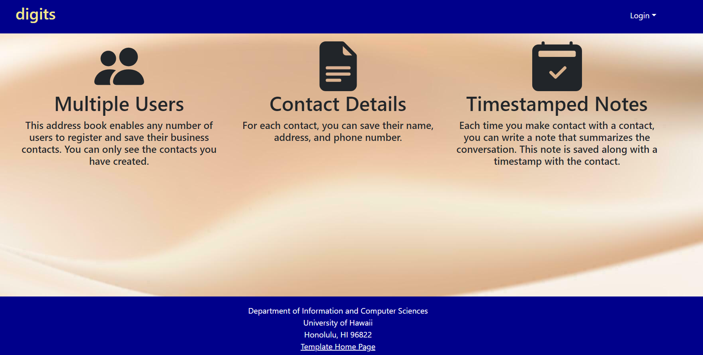
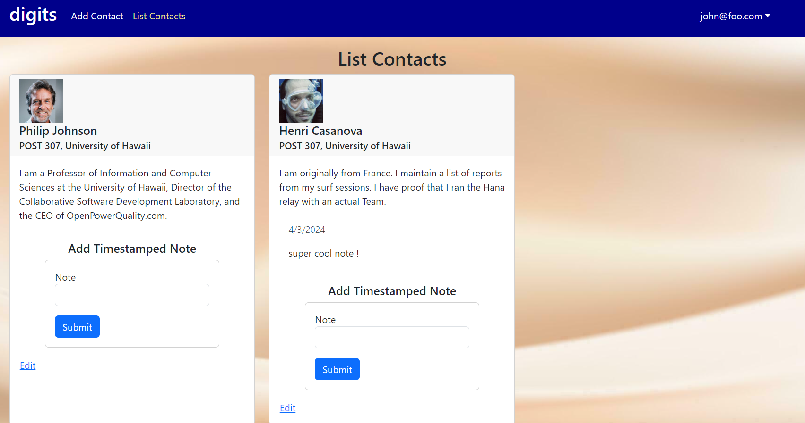
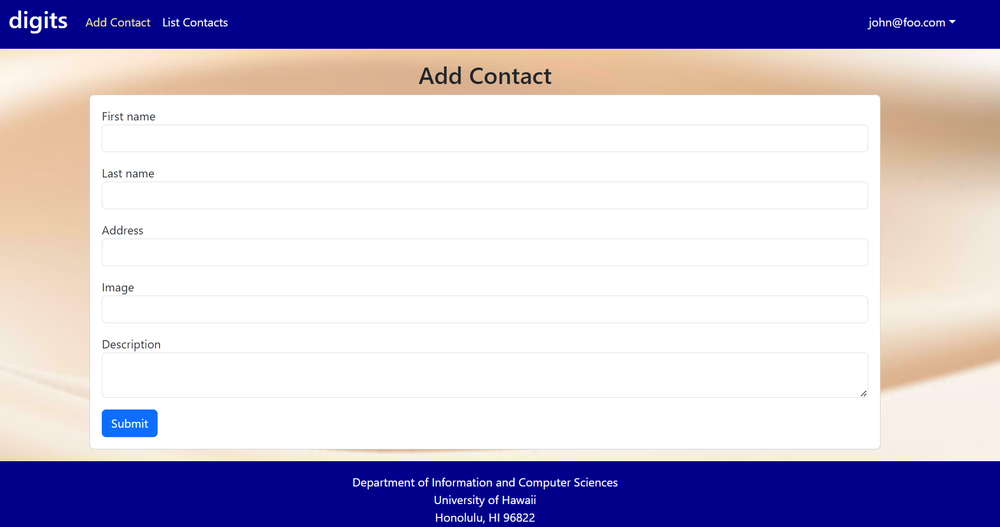
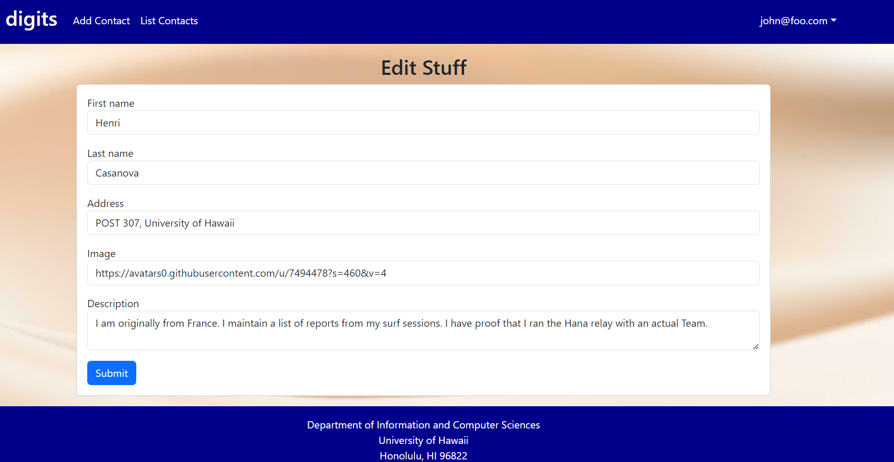

# Digits



Digits is an application that allows users to:

  * Register an account.
  * Create and manage a set of contacts
  * Add a set of timestamped notes regarding their interactions with each contact


## Installation

First, [install Meteor](https://www.meteor.com/install).

Second, download a copy of [Digits](https://github.com/daevinbag/digits). Note that Digits is a private repo and you will need to request permission from the author to gain access to the repo.

Third, cd into the app directory and install the required libraries with:

```
$ meteor npm install
```

Then after you install all the required libraries you can run the application with:

```
$ meteor npm run start
```

The first time you run the app, it will create some default users and data. 

## User Interface Walkthrough

### Landing Page
When you first bring up the application you will see the landing page that provides a brief introduction to the capabilities of Digits


### Register
If you do not have an account on the system you can register by clicking on Login and then Sign Up

### Sign In
Click on the Login link, then click on the Sign in link to bring up the Sign In page which allows you to login

### User home page
After successfully logging in, the system takes you to your home page. It is just like the landing page, but the NavBar contains links to list contact and add new contacts

### List Contacts
Clicking on the List Contacts link brings up a page that lists all of the contacts associated with the logged in user, this page also allows users to add timestamped notes detailing interactions they've had with the Contact.


### Add Contacts
On the Navbar the user can go to the Add Contacts page where they can fill in information for a contact they want to add to their list and when submitted will be displayed on the contact list.


### Edit Contacts
From the List Contacts page, the user can click the “Edit” link associated with any Contact to bring up a page that allows that Contact information to be edited


### Admin Mode 
It is possible to designate one or more users as “Admins” through the settings file. When a user has the Admin role, they get access to a special NavBar link that retrieves a page listing all Contacts associated with all users